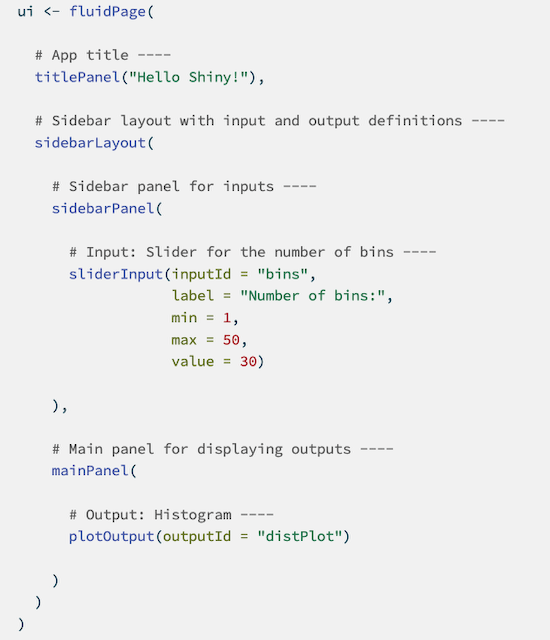
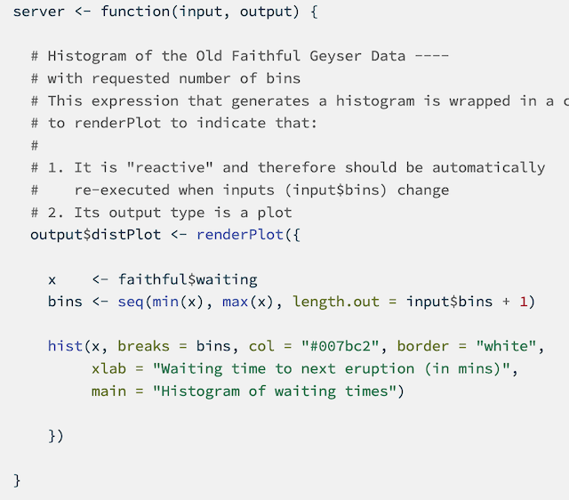
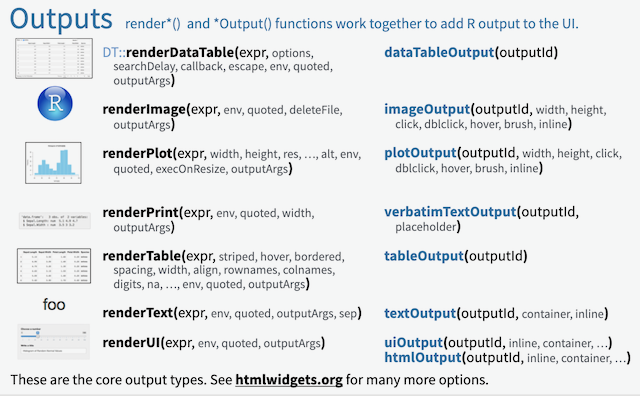
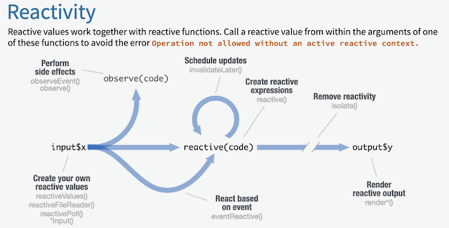

# Shiny

- Shiny is an R package that enables the development of interactive web applications solely using R
- Shiny simplifies normal web dev things such as HTML, CSS, and Javascript
- Shiny apps have two main components:
    - UI (frontend)
    - Server (backend)
    
# Installing Shiny

```{r}
# install.packages("shiny") # run this once

library(shiny)
```


# See Example Apps

```{r}
runExample(NA)

# runExample("example_name")
```

- `NA` in `runExample` displays all 11 built-in shiny examples
- Use `runExample` with one of the 11 listed apps to see it in action
    - The apps will run as expected, but they also include annotated code to explain their core concept
    

# Structure of a Shiny App

- 3 components live in app.R
    - user interface (ui): controls the look of the app
    - server function: builds the app and adds reactive component
    - `shinyApp()` function call: displays the app


## A Basic UI

```{r eval=F}
ui <- fluidPage(
  titlePanel("Shiny App Title"),
  
  sidebarLayout(
    
    sidebarPanel(
      # inputs/filters here
    ),
    
    mainPanel(
      # outputs (e.g. tables/plots) here
    )
  )
)
```

- `fluidPage()` automatically rescales the window to fit the device
- `sidebarLayout()` requires a `sidebarPanel()` and `mainPanel()`
- Naming UI elements is important for controlling them with the server function

## Hello Shiny UI Example



## A Basic Server

```{r eval=F}
server <- function(input, output) {
  # output code here
}
```

- `server()` requires input and output parameters
    - There are optional parameters that can be added (e.g. session)
- `server()` creates a list of outputs for the UI to handle


## Hello Shiny Server Example




## Running the App

```{r eval=F}
library(shiny)

ui <- ...

server <- ...

shinyApp(ui = ui, server = server)
```

- `shinyApp()` requires a ui parameter and server parameter
- Think of this function as the main function from other programming languages


# Let's Create a New Shiny App

```{r eval=F}
library(shiny)

ui <- fluidPage(

)

server <- function(input, output) {

}

shinyApp(ui = ui, server = server)
```

- Create a new shiny app file
    - This changes the "Run" option to "Run App"
- This is the minimum amount of code to run a shiny app


## Data Set Up

```{r eval=F}
library(shiny)
library(tidyverse)
library(nycflights13)

data <- flights %>% filter(month == 1)

ui <- fluidPage...
```

- Import `tidyverse` and `nycflights13` near the top of the file
- Subset the flights table before the ui definition to just January to reduce data overhead
    - This code will only be run once when the app is started


# Creating the UI

```{r eval=F}
ui <- fluidPage(
  titlePanel("Title panel"),
  
  sidebarLayout(
    sidebarPanel("Sidebar panel"),
    mainPanel("Main panel")
  )
)
```

- A sidebar layout is not required, but it is a very common layout with `fluidPage()`
- Don't forget the commas!
- `sidebarLayout()` takes a parameter `position="right"` to move the sidebar right


## Adding HTML Content

```{r eval=F}
p("text") # paragraph text
h1("text") # 1st header
...
h6("text") # 6th header (and last header)
br() # line break
code("code here") # code format
strong("bold") # bold text
em("italic") # italicized text
# and more
```

- These are wrapper functions to HTML code
- Add these to sidebar or main panels to see text
- `align="center"` and other HTML parameters work in these functions

## Changing App Text

- Change the app title panel to "NYC Flights Dashboard"
- Change the main panel to include a 3rd level header that says "Data from January of 2013"

## Changing App Text Solution

```{r eval=F}
# ignoring unchanged lines

titlePanel("NYC Flights Dashboard")

mainPanel(h3("Data from January of 2013"))
```


## Adding Widgets

- Widgets are things like buttons, sliders, menus, and input fields that make the app interactive
- See [link](https://shiny.posit.co/r/gallery/widgets/widget-gallery/) for examples
- Some options: `actionButton`, `checboxInput`, `dateInput`, `radioButtons`

## Widget Structure

```{r eval=F}
actionButton("inputID", label = "widget_name")

?selectInput
```

- All widgets need two components:
    - An `inputID` so the server can associate a name to a value (not shown to the user)
    - A `label` that is legible above the widget
- Some widgets require additional parameters that can be found in their documentation


## Let's Add Some Widgets

- In the sidebar section, add a `checkboxGroupInput` to filter the NY airport origin
    - `?checkboxGroupInput` is helpful for the necessary parameters
    - Check the `origin` column of the data to see the airport abbreviations
    
## Widget Solution

```{r eval=F}
sidebarPanel(
  checkboxGroupInput("NY_airport", "Airports:",
                      choices = c("EWR", "LGA", "JFK"),
                      selected = c("EWR", "LGA", "JFK"))
)
```

- `choices` and `selected` are the two required parameters

## Additional Widgets

```{r eval=F}
# under library() calls
min_dist <- min(data$distance, na.rm = TRUE)
max_dist <- max(data$distance, na.rm = TRUE)

sidebarPanel(
  ...
  
  checkboxInput("include_delayed", "Include Delayed Flights",
                value = TRUE),
  
  dateRangeInput("date_range", "Date Range:", 
                 start = "2013-01-01", end = "2013-01-31",
                 min = "2013-01-01", max = "2013-01-31"),
  
  sliderInput("distance", "Flight Distance:",
              min = min_dist, max = max_dist,
              value = c(min_dist, max_dist))
)
```

## Main Panel Output

```{r eval=F}
mainPanel(
  
  ___Output("output_name")
  
)
```

- These create placeholders for output in the UI
- `output_name` must match name from the server function (yet to make)
- Examples: `imageOutput()`, `plotOutput()`, `tableOutput()`, `textOutput()`, etc...


## Adding Outputs to the Flights App

- Within the main panel, lets add:
    - a plot output called `flights_per_day`
    - a plot output called `top_dest`
    - a table output called `most_delayed`
    
## Adding Outputs Solution

```{r eval=F}
mainPanel(
  h3("Data from January of 2013"),
  
  plotOutput("flights_per_day"),
  plotOutput("top_dest"),

  tableOutput("most_delayed")
)
```

- Note the line separations will not create separation in the UI
    - Use `br()` for break lines

# Creating the Server

```{r eval=F}
server <- function(input, output) {
  
  output$output_name <- render___({
    # code to create output here
  })
  
}
```

- This is the general server structure
- `input` and `output` parameters are required
    - `input` gives values from widgets in the UI
    - `output` is a named list for the UI to retrieve output objects
    
## Types of render___()

- Examples: `renderImage()`, `renderPlot()`, `renderTable()`, `renderText()`
- There is a one-to-one correspondence between `___Output()` in the UI and `render___()` in the server




## How to Use Widget Values

```{r eval=F}
# in the UI
selectInput("var", label = "Choose a variable:"
            choices = c("A", "B", "C", "D", "E"),
            selected = "A")

textOutput("selected_var")

# in the server
output$selected_var <- renderText({
  paste("You have selected", input$var)
})
```

- `input$widget_id` within the server gives access to widget values
    - Note: not all widgets are length 1 vectors
- If a input value changes, shiny automatically updates its output
    - This is what makes shiny so easy to use


## Adding Server Functionality to Flights App

```{r eval=F}
output$flights_per_day <- renderPlot({
  filtered_data() %>% select(day, origin) %>%
    group_by(day, origin) %>%
    summarize(total_flights = n()) %>%
    ggplot(aes(x = day, y = total_flights, group = origin, color = origin)) +
    geom_line() +
    labs(x = "Day in January", y = "Number of Flights", title = "Flights by Day and Origin")
})
```

- This is code required to create the `flights_per_day` plot
- I will send the rest of the server code in slack to paste into your code


# App Execution

```{r eval=F}
shinyApp(ui = ui, server = server)
```

- All shiny apps use this line of code to display the app
- Knowing how the app updates itself is important for app performance and efficiency

## App Updates

- `shinyApp()` is run once when the app is first launched
    - Load data, libraries, objects outside of `server`
- `server` function runs once per user session (when app hosted online)
- `render___()` are run each time one of their inputs changes
    - Reduce inputs in `render___()` because one input changes requires the whole function to run again

## Reactivity in Shiny



- This graphic is found on the shiny cheatsheet is more info about reactive functions
- Ex: Reactivity can be controlled so outputs will only update after a submit button is pressed
    - See `bindEvent()` documentation


## Example of Reactive Function

```{r eval=F}
filtered_data <- reactive({
    filtering <- data %>% filter(origin %in% input$NY_airport)
    if (input$include_delayed) {}
    else {
      filtering <- filtering %>% filter(dep_delay <= 0)
    }
    filtering <- filtering %>% filter(day >= as.integer(str_sub(input$date_range[1], 9, 10)),
                                      day <= as.integer(str_sub(input$date_range[2], 9, 10)))
    filtering <- filtering %>% filter(distance >= input$distance[1],
                                      distance <= input$distance[2])
    filtering
  })
```

- This reactive function filters the data based on the widgets
- Instead of each function separately filtering the data the same way, this saves the data as `filtered_data()` which the functions can access
- If a widget value changes, then `filtered_data()` updates automatically and the render functions will update


# Bonus: Themes

```{r eval=F}
library(bslib)

iu <- fluidPage(
  theme = bs_theme(bootswatch = "darkly"),
  ...
)
```

- `bslib` offers easy to implement themes that improve the default shiny look
    - See `bootswatch_themes()` to see available theme options
- The themes can be personalized with `bs_theme()`
    - See `?bs_theme` for more info
    
# Next Steps

- [See Posit's Tutorial](https://shiny.posit.co/r/getstarted/shiny-basics/lesson1/index.html)
    - Heavily influenced this workshop
- [Next Steps](https://shiny.posit.co/r/getstarted/next-steps/)
- [Articles](https://shiny.posit.co/r/articles/)
- [Gallery] (https://shiny.posit.co/r/gallery/)
- NB: [Shiny for Python](https://shiny.rstudio.com/py/)

# References

- https://shiny.posit.co/r/getstarted/shiny-basics/lesson1/
- https://raw.githubusercontent.com/rstudio/cheatsheets/main/shiny.pdf


