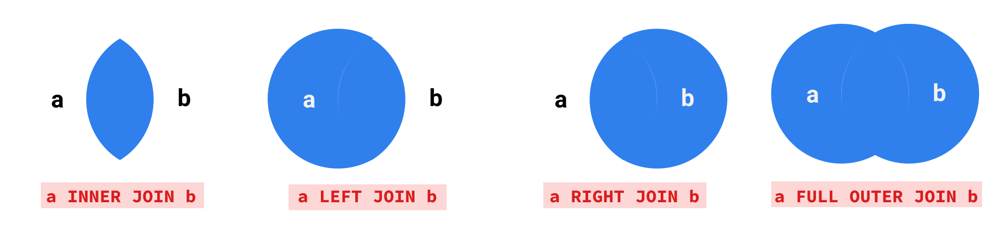

# SQL

- SQL == Structured Query Language
- Made by IBM in 1974 to handle large datasets
- Works with data in 3 ways:
    - Query
    - Maintenance
    - Definition

. . .

| **Category**  | **Statement** | **Purpose**              |
|---------------|---------------|--------------------------|
| _Query_       | Select        | Display rows of table(s) |
| _Maintenance_ | Insert        | Add rows to a table      |
|               | Update        | Change rows in a table   |
|               | Delete        | Remove rows from a table |
| _Definition_  | Create        | Add tables               |
|               | Drop          | Remove tables            |


# Definitions

Here is a very basic query structure:
```{r eval = F}
SELECT columns
FROM table
WHERE comparisons
```

- Keywords: reserved special words
    - SELECT, FROM, WHERE, etc...
    - SELECT == select == SeLEcT (but usually uppercase)
- Clauses: are name after their keywords
    - SELECT clause, FROM clause, WHERE clause
    - Typically each clause gets its own line for readability, but not necessary
- Parameters: variable part of clauses
    - Ex: specific column names, values, etc...


# Table Structure

- Data is stored similar to the tidy format from R
    - Rows are individual observations
    - Columns are variables
    - Cells are values
- Normalization in SQL is the process of reducing data redundancy
    - Typically, data is stored across multiple tables
    - The relationship of the data dictates table structure
- Keys are columns that are used to join tables
    - Primary keys uniquely identify rows
        - Composite keys occur when multiple columns identify a row
    - Foreign keys are primary keys stored outside of their primary table


## Basic Table Example


## Basic Relationships

- One:Many
    - Add a table to store repeated information by referencing its key
    - Shown in the example above
- Many:Many
    - Create a "transaction" table to store keys from two tables

. . . 


# Getting Started with SQL in R

```{r}
# install.packages("DBI")
library(DBI)
```

- DBI is an interface with these database backends:
    - RPostgres
    - RMariaDB
    - RSQLite
    - odbc
    - bigrquery
    - and more

# Creating a temporary table in memory

```{r}
# opening a connection
con <- dbConnect(RSQLite::SQLite(), dbname = ":memory:")

# creating a new table from a dataframe
dbWriteTable(con, "mtcars", mtcars)
```

- Here we open a connection to a SQLite database in memory
    - Usually you provide username, password, host, port to connect to online server
- con is initially empty, so we write the built-in mtcars table to a table called "mtcars"


## A More Realistic Connection

.png)

- This is a SQL endpoint from AWS

## Connection Continued


- This information is used in MySQL to connect to data not stored locally

# Basic Functionality

```{r}
dbListTables(con) # list tables

dbListFields(con, "mtcars") # list columns of mtcars table

dbReadTable(con, "mtcars") # show data from mtcars table
```


# Writing Basic Queries

```{r}
sql <- "
  SELECT *
  FROM mtcars
  LIMIT 5
"

query <- dbSendQuery(con, sql)
dbFetch(query)
```

- The `*` is a special symbol for all columns

## Similarly, ...

```{r}
dbClearResult(query)

sql <- "
  SELECT *
  FROM mtcars
"

query <- dbSendQuery(con, sql)
dbFetch(query, n = 5)
```


- You can specify how many rows to retrieve in `dbFetch()`
    - The default behavior is `n=-1`

## Selecting Specific Columns

```{r}
dbClearResult(query)

sql <- "
  SELECT mpg, cyl AS cylinders, hp AS horsepower
  FROM mtcars
"

query <- dbSendQuery(con, sql)
dbFetch(query, n = 5)
```

- Separate columns with a comma
- Column output can be renamed with `AS`

## Selecting Unique Values

```{r}
dbClearResult(query)

sql <- "
  SELECT DISTINCT cyl AS cylinders
  FROM mtcars
"

query <- dbSendQuery(con, sql)
dbFetch(query)
```

- Use the keyword `DISTINCT` to find the unique values in a column


# Filtering Rows

```{r}
dbClearResult(query)

sql <- "
  SELECT mpg, cyl AS cylinders, hp AS horsepower
  FROM mtcars
  WHERE mpg > 20 AND cyl = 6 AND hp <>  90
"

query <- dbSendQuery(con, sql)
dbFetch(query, n = 5)
```

- The results display only rows where the WHERE clause evaluates to TRUE (removes missing values)
- Not equals works with `<>` and `!=` (in this SQL version)
- Test for equivalence with a single `=`

## More Filtering Details

- Place non-numeric date in quotes `''`
    - `WHERE country = 'United States'`
    - `WHERE date = '2023-05-14'`
- `OR` can be used instead of `AND`
- To check for missing values use `IS NULL` or `IS NOT NULL`
- For negation, use the keyword `NOT`

## More Filtering

```{r}
dbClearResult(query)

sql <- "
  SELECT mpg, cyl AS cylinders, hp AS horsepower
  FROM mtcars
  WHERE cyl IN (4, 6)
"

query <- dbSendQuery(con, sql)
dbFetch(query, n = 5)
```

- `IN` is more concise than `cyl = 4 OR cyl = 6`

## Even More Filtering

```{r}
dbClearResult(query)

sql <- "
  SELECT mpg, cyl AS cylinders, hp AS horsepower
  FROM mtcars
  WHERE mpg BETWEEN 10 AND 20
"

query <- dbSendQuery(con, sql)
dbFetch(query, n = 5)
```

- `BETWEEN` is more concise than `MPG > 10 AND MPG < 20`

# Ordering Results

```{r}
dbClearResult(query)

sql <- "
  SELECT mpg, cyl AS cylinders, hp AS horsepower
  FROM mtcars
  ORDER BY mpg
"

query <- dbSendQuery(con, sql)
dbFetch(query, n = 5)
```

- The default ordering is ascending

## Descending Order

```{r}
dbClearResult(query)

sql <- "
  SELECT mpg, cyl AS cylinders, hp AS horsepower
  FROM mtcars
  ORDER BY mpg DESC
"

query <- dbSendQuery(con, sql)
dbFetch(query, n = 5)
```

- Use the `DESC` keyword

## Ordering by Multiple Columns

```{r}
dbClearResult(query)

sql <- "
  SELECT mpg, cyl AS cylinders, hp AS horsepower
  FROM mtcars
  ORDER BY mpg DESC, cyl
"

query <- dbSendQuery(con, sql)
dbFetch(query, n = 10)
```

- The results with be sorted by mpg descending
- For equal mpg values, the cyl values with by sorted in ascending order


# Basic Arithmetic Expressions

```{r}
dbClearResult(query)

sql <- "
  SELECT mpg + cyl, cyl - drat, (disp * carb) / qsec
  FROM mtcars
  ORDER BY mpg + cyl
"

query <- dbSendQuery(con, sql)
dbFetch(query, n = 5)
```

- `+-*/()` all work as expected
- Calculates values per row by default
- Creates new columns for the results
    - Columns can be renamed


# Aggregate Functions

```{r}
dbClearResult(query)

sql <- "
  SELECT COUNT(*), SUM(cyl), MIN(mpg), MAX(mpg), AVG(hp) AS avg_hp
  FROM mtcars
"

query <- dbSendQuery(con, sql)
dbFetch(query, n = 5)
```

- `SUM()`, `MIN()`, `MAX()`, `AVG()` work as expected
- `COUNT()` is tricky
    - `COUNT(*)` counts all rows
    - `COUNT(mpg)` counts all non empty rows in `mpg`
    - `COUNT(DISTINCT mpg)` counts all distinct values in `mpg`
    
    
# Grouping Results

```{r}
dbClearResult(query)

sql <- "
  SELECT cyl, AVG(hp) AS avg_hp
  FROM mtcars
  GROUP BY cyl
"

query <- dbSendQuery(con, sql)
dbFetch(query, n = 5)
```

- Non grouped columns must be in aggregate functions

## Grouping by Multiple Columns

```{r}
dbClearResult(query)

sql <- "
  SELECT cyl, vs, AVG(hp) AS avg_hp
  FROM mtcars
  GROUP BY cyl, vs
  ORDER BY avg_hp DESC
"

query <- dbSendQuery(con, sql)
dbFetch(query)
```

- Groups by cyl first, then vs
    - Similar to `ORDER BY` clause from earlier
- Ordering happens at the end, so can use calculated columns
    

## Filtering Grouped Results

```{r}
dbClearResult(query)

sql <- "
  SELECT cyl, vs, AVG(hp) AS avg_hp
  FROM mtcars
  GROUP BY cyl, vs
  HAVING avg_hp > 100
"

query <- dbSendQuery(con, sql)
dbFetch(query)
```

- `HAVING` clause is like `WHERE` clause, but happens after grouping


# Summary of Clause Order

```{r eval = F}
"SELECT
FROM
WHERE
GROUP BY
HAVING
ORDER BY
LIMIT"
```

- The order cannot be swapped

## Full Example

```{r}
dbClearResult(query)

sql <- "
  SELECT cyl, vs, AVG(hp) AS avg_hp
  FROM mtcars
  WHERE am = 1 AND gear >= 3
  GROUP BY cyl, vs
  HAVING avg_hp > 100
  ORDER BY cyl
  LIMIT 5
"

query <- dbSendQuery(con, sql)
dbFetch(query)
```

# Joining Tables

Consider a different dataset with multiple tables about flights in and out of NYC

```{r}
dbDisconnect(con)

# install.packages(nycflights13)
library(nycflights13)

flights_subset <- nycflights13::flights[1:2000, ]

con <- dbConnect(RSQLite::SQLite(), dbname = ":memory:")
dbWriteTable(con, "flights", flights_subset)
dbWriteTable(con, "airports", nycflights13::airports)
```

- We will consider the flights and airports tables 

## Flight Data Structure


## Types of Joins



## Join Example

```{r}
sql <- "
  SELECT month, day, dep_time, origin, dest
  FROM flights AS f
    INNER JOIN airports AS a ON a.faa = f.dest
  WHERE tzone = 'America/Chicago'
  LIMIT 10
"

query <- dbSendQuery(con, sql)
dbFetch(query)
```

- Joins need `ON` to know how to join
    - `ON` criteria can be more than 1 column
- AUS is Austin, TX


# Common Table Expressions

```{r}
dbClearResult(query)

sql <- "
  WITH highest_avg_delay_dest AS (
    SELECT dest, AVG(dep_delay)
    FROM flights
    WHERE dep_delay > 0
    GROUP BY dest
    LIMIT 1
  )
  SELECT f.dest, day, COUNT(*) as num_flights, SUM(dep_delay) as total_delay, AVG(dep_delay) as avg_delay
  FROM flights f
    INNER JOIN highest_avg_delay_dest hadd ON hadd.dest = f.dest
  WHERE dep_delay > 0
  GROUP BY f.dest, day
  ORDER BY day ASC
"

query <- dbSendQuery(con, sql)
dbFetch(query)
```

- Common Table Expressions allow for queries to happen in sequence for more complex queries
- Remember the data here is a small subset, so we only get two days of data
- There are other types of sub-queries, but I like CTEs for their readability


# Exercises

Consider a smaller dataset about flowers

```{r}
dbDisconnect(con)

con <- dbConnect(RSQLite::SQLite(), dbname = ":memory:")

dbWriteTable(con, "iris", iris)

dbReadTable(con, "iris")
```

## Exercise 1

How many flowers are there for each species and what is their average sepal length?

-Note: \`column.name\` forces SQL to consider `column.name` is a column, not as table `column` with column `name`

## Exercise 1 Solution

```{r}
sql <- "
  SELECT Species, COUNT(*), AVG(`Sepal.Length`) as avg_length
  FROM iris
  GROUP BY Species
"

query <- dbSendQuery(con, sql)
dbFetch(query)
```

## Exercise 2

Which rows have the sum of sepal length, sepal width, petal length, petal width larger than 10 order by petal length descending and limit to 10 results?

## Exercise 2 Solution

```{r}
dbClearResult(query)

sql <- "
  SELECT *
  FROM iris
  WHERE (`Sepal.Length` + `Sepal.Width` + `Petal.Length` + `Petal.Width`) > 10
  ORDER BY `Petal.Length` DESC
  LIMIT 10
"

query <- dbSendQuery(con, sql)
dbFetch(query)
```

## Exercise 3

What two species of have highest sepal length to sepal width ratio?

## Exercise 3 Solution

```{r}
dbClearResult(query)

sql <- "
  SELECT Species, `Sepal.Length`/`Sepal.Width` AS ratio
  FROM iris
  GROUP BY Species
  ORDER BY ratio DESC
  LIMIT 2
"

query <- dbSendQuery(con, sql)
dbFetch(query)
```


# Conclusion

- We learned:
    - the purpose of SQL
    - SQL's basic functions
    - how data is stored
    - how to query databases with `SELECT`
- Not covered:
    - maintaining tables
    - defining tables


# References

- https://cdncontribute.geeksforgeeks.org/wp-content/uploads/SQL-Manual.pdf
- https://dbi.r-dbi.org/


